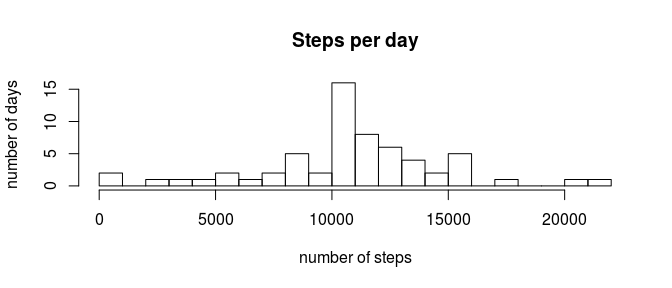

# Reproducible Research: Peer Assessment 1


###Loading and preprocessing the data

```r
  data <- read.csv(unz("activity.zip", "activity.csv"))
```

### What is mean total number of steps taken per day?
For this part of the assignment, you can ignore the missing values in the dataset.

```r
data.na.rm <- data[!is.na(data$steps), ]
```

1. Make a histogram of the total number of steps taken each day

```r
steps.per.date <- ddply(data.na.rm, "date", summarize, tt = sum(steps))
hist(steps.per.date$tt, breaks = 20, main = "Steps per day", ylab = "number of days", 
    xlab = "number of steps")
```

 

2. Calculate and report the mean and median total number of steps taken per day

```r
paste("Mean:", round(mean.steps.per.day <- mean(steps.per.date$tt)))
paste("Median:", median.steps.per.day <- median(steps.per.date$tt))
```

```
## [1] "Mean: 10766"
## [1] "Median: 10765"
```

### What is the average daily activity pattern?
1. Make a time series plot (i.e. type = "l") of the 5-minute interval (x-axis) and the average number of steps taken, averaged across all days (y-axis)

```r
steps.per.interval <- ddply(data.na.rm, "interval", summarize, steps=mean(steps))
p1 <- ggplot(steps.per.interval, aes(x=interval, y=steps)) 
p1 <- p1 + geom_line() 
p1 <- p1 + geom_smooth(method=loess, span=0.15, size=2, se=F)
p1
```

 

2. Which 5-minute interval, on average across all the days in the dataset, contains the maximum number of steps?

```r
steps.per.interval[which.max(steps.per.interval$steps), ]
```

```
##     interval    steps
## 104      835 206.1698
```

### Imputing missing values
Note that there are a number of days/intervals where there are missing values (coded as NA). The presence of missing days may introduce bias into some calculations or summaries of the data.

1. Calculate and report the total number of missing values in the dataset (i.e. the total number of rows with NAs)

```r
colSums(is.na(data))
```

```
##    steps     date interval 
##     2304        0        0
```

2 .Devise a strategy for filling in all of the missing values in the dataset. The strategy does not need to be sophisticated. For example, you could use the mean/median for that day, or the mean for that 5-minute interval, etc.

> My strategy uses (a) the average steps per interval _steps.per.interval_ to create a PDF of steps according to interval and (b) a random total of steps per day sampled with replacement from _steps.per.date_. Those values are then multiplied to replace missing number of steps by a reasonable value.


```r
steps.per.interval.pdf <-
  data.frame(interval=steps.per.interval$interval, 
  steps=steps.per.interval$steps/sum(steps.per.interval$steps))
data.fill <- merge(data, steps.per.interval.pdf, by="interval")

steps.per.date.pdf <- density(steps.per.date$tt)
set.seed(12345)
data.fill$rand.day.tt <- round(sample(steps.per.date$tt, dim(data.fill)[1], replace=TRUE))
data.fill$steps <- 
  ifelse(is.na(data.fill$steps.x), 
         round(data.fill$steps.y*data.fill$rand.day.tt), 
         data.fill$steps.x)
```

3. Create a new dataset that is equal to the original dataset but with the missing data filled in.

```r
data.fill <- data.fill[order(data.fill$date, data.fill$interval), c("steps", "date", "interval")]
```

4. Make a histogram of the total number of steps taken each day and Calculate and report the mean and median total number of steps taken per day. Do these values differ from the estimates from the first part of the assignment? What is the impact of imputing missing data on the estimates of the total daily number of steps?


```r
steps.per.date.fill <- ddply(data.fill, "date", summarize, tt=sum(steps))
mean.steps.per.day.fill <- mean(steps.per.date.fill$tt)
median.steps.per.day.fill <- median(steps.per.date.fill$tt)
hist(steps.per.date.fill$tt, breaks=20, main="Steps per day", ylab="number of days", xlab="number of steps")
```

 

> Answer: The new histogram follows a similar distribution, however with an accentuation around the mean. Both the new mean 10771 and the new median 10765 are very close to the previous respective values 10766 and 10765.

### Are there differences in activity patterns between weekdays and weekends?
For this part the weekdays() function may be of some help here. Use the dataset with the fille-in missing values for this part.  

1. Create a new factor variable in the dataset with two levels -- "weekday" and "weekend" indicating whether a given date is a weekday or weekend day.


```r
Sys.setlocale("LC_TIME", "C")
data.fill$wkd <- as.factor(
  ifelse(weekdays(as.POSIXlt(data.fill$date)) %in% c("Saturday", "Sunday"), 
         "weekend", 
         "weekday"))
```

2. Make a panel plot containing a time series plot (i.e. type = "l") of the 5-minute interval (x-axis) and the average number of steps taken, averaged across all weekday days or weekend days (y-axis). 


```r
analytic.data.wkd <- ddply(data.fill, c("wkd", "interval"), summarize, steps=mean(steps))
g1 <- ggplot(analytic.data.wkd, aes(x=interval, y=steps)) 
g1 <- g1 + geom_line() 
g1 <- g1 + geom_smooth(method=loess, span=0.15, size=1, se=F) 
g1 <- g1 + facet_grid(wkd~.)
g1
```

 

> Answer: The graphs show that there are different patterns between weekdays and weekends. People start and stop walking earlier during the former in comparison with the latter. In addition, there is an accentuated activity peak on weekday mornings, while the activity is more equaly distributed throughout the day on weekends. Moreover, the graphs suggest there is more activity on weekends in general, which can be confirmed by a T-test:

```r
steps.per.wkd <- ddply(data.fill, c("wkd", "date"), summarize, steps=mean(steps))
table(steps.per.wkd[,1])
(test <- t.test(steps~wkd, steps.per.wkd))
```

```
## 
## weekday weekend 
##      45      16 
## 
## 	Welch Two Sample t-test
## 
## data:  steps by wkd
## t = -2.2942, df = 53.563, p-value = 0.02573
## alternative hypothesis: true difference in means is not equal to 0
## 95 percent confidence interval:
##  -12.4766898  -0.8385687
## sample estimates:
## mean in group weekday mean in group weekend 
##              35.65270              42.31033
```
> Considering the usual 95% confidence level and the very small resulting p-value 0.0257, we can say that the difference is statistically significant.
